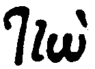

---
---

This is a project for generating an edition-specific OCR training file for [Kraken](http://kraken.re/) for Evgenios Voulgaris' Greek translation of the Aeneid.

## Instructions

 * Pick a non-corrected page (❌) from the list below (you might also check that there are no open [issues](https://github.com/ryanfb/kraken-voulgaris-aeneid/issues) for your page).
 * Feel free to open a provisional issue with the page you're working on (e.g. `voulgaris_1_page_00046`), if you want to avoid any potential duplication of effort. Simply close the issue if you abandon the work.
 * Read lines in image and correct the transcription to reflect *diplomatic* ground truth of what's represented in the image.
 * Pages are prefilled with OCR output from the [`kraken-gaza-iliad`](https://github.com/ryanfb/kraken-gaza-iliad) model. There will be plenty of errors, so if you feel it's faster to simply erase a line and type the transcription instead of correcting the prefilled output, feel free.
 * When done with a page, click "Download" (in the bottom left of the transcription page) and [make an issue](https://github.com/ryanfb/kraken-voulgaris-aeneid/issues) with the output. You can attach the downloaded HTML directly to the GitHub issue by zipping it first - on a Mac, you can right-click the file then click `Compress "filename.html"` to create a `.zip` file which GitHub will accept as an attachment.

## Notes

 * If a chunk is incorrectly chunked (multiple lines lumped together, or a single line cut in half horizontally separating the tops and bottoms of characters), simply skip it and erase any prefilled text
 * Beginning of each line is usually capitalized
 * Pay close attention to punctuation, accents, capitalization, and spacing
 * It can be helpful to consult the [Greek Word Study Tool](http://www.perseus.tufts.edu/hopper/morph) or [Index of Ancient Greek Lexica](https://dcthree.github.io/ancient-greek-lexica/) for forms that are unfamiliar. If you have access, the TLG "Text Search" tool can also be extremely useful
 * The apparatus frequently uses German-style quotation marks: „
 * This edition uses [stigma](https://en.wikipedia.org/wiki/Stigma_(letter)) for "στ": ϛ
 * You may also notice some odd-looking thetas and chis - these are σθ or σχ ligatures
 * There are also frequent "ου" ligatures: ȣ
   * Circumflex accented: ȣ͂
   * Acute accented: ȣ́
   * Grave accented: ȣ̀
   * Smooth accented: ȣ̓
   * Rough accented: ȣ̔
     * Rogh + acute: ȣ̔́
 * Other ligatures:
   *  - σπ
   *  - υν
   *  - ην (the accent, which goes over the eta in your transcription, is placed over the nu). In the smaller font of the apparatus, the ligature has a broken stroke.
   *  - τὴν

## Pages


